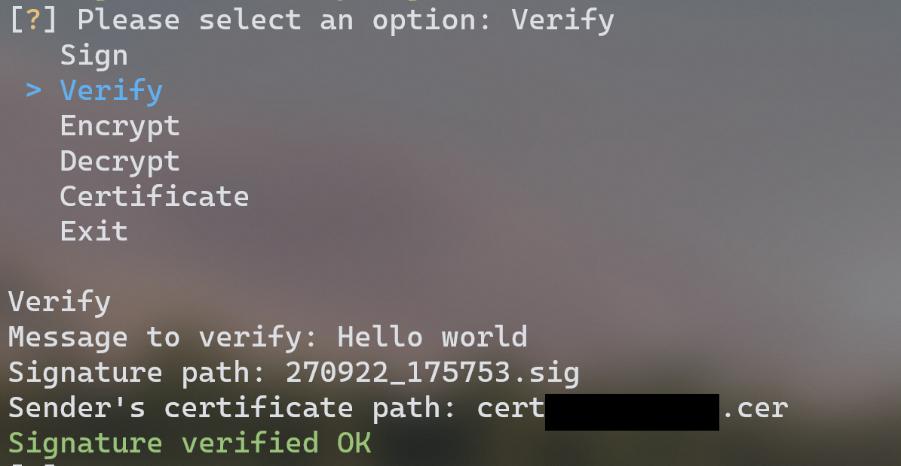

# Hong Kong Post e-Cert Utilities
Sign, verify, encrypt and decrypt messages with Hong Kong Post e-Cert (香港郵政電子證書) and other PKCS#12 certificates.


## Functions

Hong Kong Post is acting as the CA to connect legal identities with digital certificates. Therefore, signed messages can be used for identity verification or proof of true willingness (signer's authentication, data integrity and non-repudiation).
- Sign message
- Verify signature
- Encrypt message
- Decrypt message
- View certificate
- Extract public key in PEM format, RSA modulus and exponent from `.p12` file

## Getting Started

### Prerequisites
You need to have your e-Cert file in `.p12` format ready. 
- Apply a e-Cert from [Hong Kong Post e-Cert](https://www.ecert.gov.hk/product/ecert/apply/certapply.html#t1) (Note: personal e-Cert with mutual recognition status cannot be used in this programme)
- Import the PKCS#12 certificate to your computer. Please refer to [Hong Kong Post Website](https://www.ecert.gov.hk/product/ecert/ecertop/index.html) for instructions.

### Installation
1. Install dependencies for `ecert.py`

    ```
    pip install -r requirements.txt
    ```

2. It is suggested to store your PKCS#12 certificate in the same directory as the python programme.

If you don't have Python and pip, you may use the `ecert.exe` executable.

### Sign
- Enter message to sign
- Enter the path to your PKCS#12 certificate
- Enter password for your certificate (can be found in the PIN envelope if this is the first time you use it)
- If successfully signed, a `.sig` file will be generated to the directory of the programme, with the current timestamp as its filename
- You may then send the message and signature to your recipient


### Verify
- Enter message to verify
- Enter the path to the corresponding `.sig` file
- Enter the path of sender's `.cer` certificate (certificate can be found from [Hong Kong Post e-Cert Directory](https://www.ecert.gov.hk/hkpost/app/querycertstatus/web/home?lang=english&channel=WEB&certCategory=P))
- If successfully verified, you will see a message



### Encrypt
- Enter message to encrypt
- Enter the path of recipient's `.cer` certificate (certificate can be found from [Hong Kong Post e-Cert Directory](https://www.ecert.gov.hk/hkpost/app/querycertstatus/web/home?lang=english&channel=WEB&certCategory=P))
- If successfully signed, a `.enc` cipher file will be generated to the directory of the programme, with the current timestamp as its filename
- You may then send the cipher file to the recipient. He/she should be able to use his/her PKCS#12 e-Cert to decrypt


### Decrypt
- Enter the path of `.enc` cipher file
- Enter the path of your PKCS#12 e-Cert
- Enter password for your certificate (can be found in the PIN envelope if this is the first time you use it)
- If successfully decrypted, you will see the plaintext message


### View Certificate
- Enter the path of `.cer` certificate (certificate can be found from [Hong Kong Post e-Cert Directory](https://www.ecert.gov.hk/hkpost/app/querycertstatus/web/home?lang=english&channel=WEB&certCategory=P))


## Using OpenSSL CLI
Please refer to [OpenSSL Commands](./openssl_cmd.md)

## License

Distributed under the MIT License. See `LICENSE.md` for more information.

## Contact

Project Link: [https://github.com/songyuew/ecert](https://github.com/songyuew/ecert)

## Acknowledgments

- [Hong Kong Post e-Cert](https://www.ecert.gov.hk/index.html)
- [pyOpenSSL](https://www.pyopenssl.org/en/stable/index.html)
- [Cryptography](https://cryptography.io/en/latest/)
